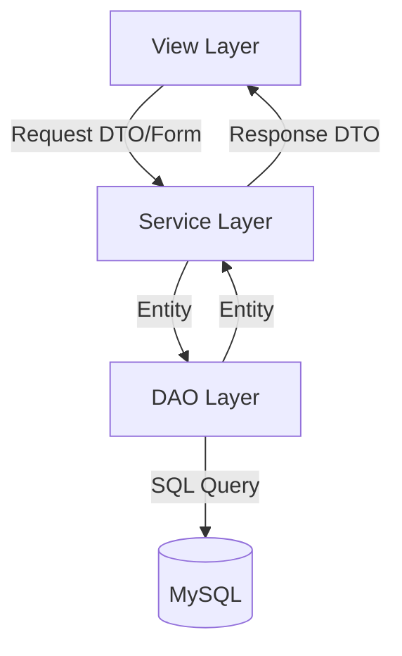
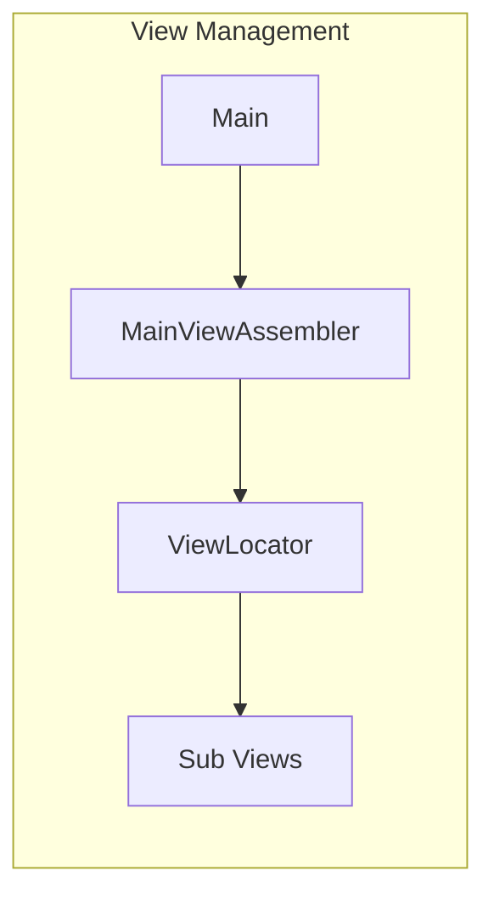

# 중고차 판매 시스템

중고차 매물을 관리하고 사용자 및 관리자 기능을 제공하는 Java 기반 콘솔 애플리케이션입니다.

## 시작하기

### 요구 사항
- **Java**: JDK 11 이상
- **Database**: MySQL 8.0 이상
- **Build Tool**: Gradle

### 데이터베이스 설정
1. MySQL에 접속하여 `used_car` 데이터베이스를 생성합니다.
   ```sql
   CREATE DATABASE used_car;
   ```
2. `dao/DaoFacotry.java` 파일에서 DB 연결 정보를 확인하고 환경에 맞게 수정합니다.
   - DB URL: `jdbc:mysql://localhost:3306/used_car`
   - User: `root`
   - Password: `(설정된 비밀번호)`

### 빌드 및 실행
프로젝트 루트 디렉토리에서 다음 명령어를 실행합니다.

```bash
# 빌드 및 실행
./gradlew run
```
*(참고: `mainClass` 설정이 되어 있지 않은 경우 `UsedCarSystemStarter.java`를 직접 실행하세요.)*

## 📂 프로젝트 구조

프로젝트는 **계층형 아키텍처(Layered Architecture)**를 따르고 있으며, 역할에 따라 패키지가 분리되어 있습니다.

### 패키지 구성
- `dao`: 데이터베이스 접근 로직 (Data Access Object)
- `dto`: 계층 간 데이터 전송 객체 (Data Transfer Object)
- `entity`: 데이터베이스 테이블과 매핑되는 도메인 모델
- `form`: 사용자 입력 데이터를 캡슐화한 객체
- `service`: 비즈니스 로직 처리
- `view`: 콘솔 UI 및 화면 흐름 제어

### 계층 간 흐름



### UI 관리 구조 (Assembler & Locator)
UI 컴포넌트의 생성과 의존성 주입을 분리하여 관리합니다.



## 설계 포인트

1. **데이터 접근 추상화 (DAO & DaoFactory)**
   - `DaoFactory`를 통해 데이터베이스 연결 및 자원 해제(`closeResources`)를 공통으로 처리합니다.
   - `DaoTemplate`과 Functional Interface(`TriFunction`)를 사용하여 반복되는 JDBC 보일러플레이트 코드를 최소화했습니다.

2. **UI 패턴 (Assembler & Locator)**
   - **Assembler**: 뷰 객체를 생성하고 필요한 서비스나 의존성을 연결하는 역할을 담당합니다.
   - **Locator**: 생성된 뷰 객체들 중 메뉴 선택에 따라 적절한 뷰를 찾아주는 역할을 담당합니다.

3. **데이터 캡슐화 (Form & DTO)**
   - 사용자 입력을 받을 때는 `Form` 객체(예: `UserRegisterForm`)를 사용하여 데이터 유효성 검증의 책임을 분리했습니다.
   - 계층 간 데이터 전달 시 `DTO`를 사용함으로써 엔티티의 직접적인 노출을 지양했습니다.

4. **객체 지향적 도메인 설계**
   - `User` 엔티티 등에 유효성 검사 및 데이터 상태 관리 로직을 포함하여 객체 지향적인 설계를 지향했습니다.
